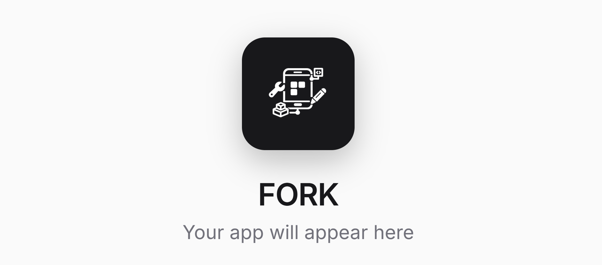
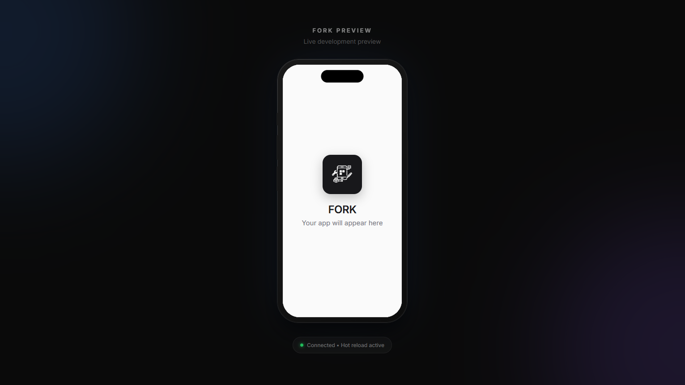

<p align="center">
  
</p>

# FORK

> AI-powered app development assistant

<p align="center">
  
</p>

## Overview

FORK is an AI-powered mobile application that helps users transform ideas into fully functional apps through an intuitive, guided development process.

## Features

- **Idea Stage** - Capture and refine your app concept
- **Persona Engine** - Define your target users and their needs
- **AI-Assisted Development** - Get intelligent suggestions throughout the process
- **Live Preview** - See your app come to life in real-time

## Tech Stack

- React Native with Expo
- TypeScript
- Zustand for state management

## Getting Started

```bash
# Install dependencies
npm install

# Start the development server
npx expo start
```

## Status

Currently in active development. See `.planning/` for roadmap and phase details.

---

Justin | MIT
