# FORK Architecture - Mermaid Diagrams

## Implementation Status

### ✅ All Commits COMPLETED

| Commit | Status | Files |
|--------|--------|-------|
| **Commit 1: Prompt Registry** | ✅ Complete | `lib/prompts/` |
| **Commit 2: Token Budgeting** | ✅ Complete | `lib/context/tokenizer.ts`, `budget.ts` |
| **Commit 3: Context Compression** | ✅ Complete | `lib/context/pack.ts` |
| **Commit 4: Memory Layer + Retrieval** | ✅ Complete | `lib/memory/store.ts`, `retrieve.ts` |
| **Commit 5: Evaluation + A/B Testing** | ✅ Complete | `lib/evaluation/log.ts` |

---

## Context Engineering Architecture (Fully Implemented)

From a context engineering perspective, this application could benefit from documenting:

1. **Context Storage Strategy** - How context is persisted in `.rork/` directory
2. **Context Retrieval** - How context is loaded and passed to AI models
3. **Prompt Templates** - How prompts are structured for each stage
4. **Context Validation** - How context quality is ensured before use
5. **Token Optimization** - How context is compressed/prioritized for LLM limits
6. **Memory Management** - Long-term vs session memory

## 1. Overall System Architecture


---

## 2. Data Flow Diagram


---

## 3. Type System Hierarchy


---

## 4. State Management Flow

```mermaid
stateDiagram-v2
    [*] --> INIT

    INIT --> IDEA: User enters idea & budget
    IDEA --> Processing: runIdeaStage()
    Processing --> IDEA: Returns Requirements

    IDEA --> PERSONA: User confirms to proceed
    PERSONA --> Processing: runPersonaStage()
    Processing --> PERSONA: Returns PersonaSet

    PERSONA --> DESIGN: Personas generated
    DESIGN --> [*]

    state Processing {
        [*] --> DetectTier
        DetectTier --> InferPlatforms
        InferPlatforms --> CheckConflicts
        CheckConflicts --> WriteFiles
        WriteFiles --> [*]
    }

    state "Zustand Store" as Store {
        project: RorkProject | null
        isLoading: boolean
        error: string | null

        setProject()
        setStage()
        setLoading()
        setError()
        reset()
    }
```



---

## 5. Library Module Dependencies


---

## 6. Feature Processing Pipeline

```mermaid
flowchart TB
    subgraph Input["Feature Input"]
        FeatureList[List of Features]
        Tier[Budget Tier]
    end

    subgraph Processing["Feature Processing"]
        subgraph Priority Assignment["Priority Assignment"]
            MustHave[MVP Must-Haves]
            ShouldHave[Should-Haves]
            NiceToHave[Nice-to-Haves]
        end

        subgraph Conflict Detection["Conflict Detection"]
            CheckAuth{Auth Required?}
            CheckStorage{Storage Required?}
            CheckNotifications{Notifications Required?}
            CheckCamera{Camera Required?}
        end

        subgraph Platform Inference["Platform Inference"]
            MobileFeatures[Mobile-Specific Features]
            WebFeatures[Web Features]
            CrossPlatform[Cross-Platform Features]
        end
    end

    subgraph Output["Processed Output"]
        PrioritizedFeatures[Sorted by Priority]
        Conflicts[Detected Conflicts]
        PlatformHints[Platform Recommendations]
        RequirementsObj[Requirements Object]
    end

    %% Flow
    FeatureList --> Priority Assignment
    Tier --> Priority Assignment

    FeatureList --> Conflict Detection
    Tier --> Conflict Detection

    FeatureList --> Platform Inference

    Priority Assignment --> Output
    Conflict Detection --> Output
    Platform Inference --> Output
```

---

## 7. Persona Generation Pipeline

```mermaid
flowchart TB
    subgraph Input["Persona Input"]
        Requirements[Requirements Object]
        Category[App Category]
        TargetUser[Target User Info]
    end

    subgraph Processing["Persona Generation"]
        subgraph Research Phase["Web Research Phase"]
            BuildQueries[Build Research Queries]
            ExecuteResearch[Execute Research]
            AggregateResults[Aggregate Results]
        end

        subgraph Generation Phase["Persona Generation"]
            GeneratePrimary[Generate Primary Persona]
            GenerateSecondary[Generate Secondary Personas]
            ValidatePersonas[Validate Personas]
        end

        subgraph Merging Phase["Merge Phase"]
            MergeDefaults[Merge with Defaults]
            QualityCheck[Quality Check]
        end
    end

    subgraph Output["Persona Output"]
        PrimaryPersona[Primary Persona]
        SecondaryPersonas[Secondary Personas]
        ResearchSummary[Research Summary]
        OutputFiles[Output Files]
    end

    %% Flow
    Requirements --> Research Phase
    Requirements --> Generation Phase
    Category --> Research Phase
    Category --> Generation Phase
    TargetUser --> Generation Phase

    Research Phase --> Generation Phase
    Generation Phase --> Merging Phase

    Merging Phase --> Output
```

---

---

## 12. Prompt Registry Architecture (Implemented)

```mermaid
flowchart TB
    subgraph Prompt Registry["lib/prompts/"]
        Registry[REGISTRY - Central Index]
        Types[types.ts - PromptSpec]
        Render[render.ts - Template Renderer]
        Stages[stages/ - Stage Prompts]
    end

    subgraph Access Control["Access Pattern"]
        GetPrompt[getPrompt(id)]
        RenderPrompt[renderPrompt(id, vars)]
        GetRendered[getRenderedPrompt(id, vars)]
    end

    subgraph Enforce["No Inline Prompts"]
        Block1["❌ Don't: Inline prompt string"]
        Block2["❌ Don't: Inline system message"]
    end

    subgraph Usage["Correct Usage"]
        Allow1["✅ Do: getPrompt('idea.generate.v1')"]
        Allow2["✅ Do: renderPrompt('persona.generate.v1', vars)"]
    end

    %% Flow
    GetPrompt --> Registry
    RenderPrompt --> Registry
    GetRendered --> Registry

    Registry --> Types
    Registry --> Render
    Registry --> Stages

    Block1 -->|Blocks| Registry
    Block2 -->|Blocks| Registry

    Allow1 --> Registry
    Allow2 --> Registry
```

---

## 13. Prompt Registry Data Flow

```mermaid
flowchart LR
    subgraph Stage Code["Stage Implementation"]
        Stage["stages/idea.ts"]
    end

    subgraph Prompt Access["Prompt API"]
        API[lib/prompts/index.ts]
    end

    subgraph Registry["Registry Data"]
        Spec[PromptSpec
            id: "idea.generate.v1"
            stage: "IDEA"
            version: "1.0.0"
            system: ...
            user: ...
            tags: [...]
        ]
    end

    subgraph Render["Template Renderer"]
        RenderFn[render(template, vars)]
    end

    subgraph LLM["LLM Call"]
        SystemMsg["System: You are FORK..."]
        UserMsg["User: Transform this idea..."]
    end

    %% Connections
    Stage -->|getPrompt(id)| API
    API -->|returns| Spec
    Spec -->|user template| RenderFn
    Spec -->|system message| SystemMsg
    RenderFn -->|rendered user| UserMsg
    SystemMsg --> LLM
    UserMsg --> LLM
```

---

## 14. Next Steps: Token Budgeting (Commit 2)


## Legend

### File Locations (Updated)
- **`app/src/stages/`** - Main stage processing modules
- **`app/src/stores/`** - State management (Zustand)
- **`app/src/lib/prompts/`** - ✅ Prompt Registry (Implemented)
- **`app/src/lib/context/`** - ✅ Token Budgeting & Context Packs (Implemented)
- **`app/src/lib/memory/`** - ✅ Memory Layer & Retrieval (Implemented)
- **`app/src/lib/evaluation/`** - ✅ Evaluation & A/B Testing (Implemented)
- **`app/src/types/`** - TypeScript type definitions

### Context Engineering Modules (All Implemented)

| Module | Files | Status |
|--------|-------|--------|
| **Prompt Registry** | `lib/prompts/index.ts`, `types.ts`, `render.ts`, `stages/*.ts` | ✅ Complete |
| **Token Budgeting** | `lib/context/tokenizer.ts`, `budget.ts` | ✅ Complete |
| **Context Compression** | `lib/context/pack.ts` | ✅ Complete |
| **Memory Store** | `lib/memory/store.ts` | ✅ Complete |
| **Retrieval** | `lib/memory/retrieve.ts` | ✅ Complete |
| **Evaluation** | `lib/evaluation/log.ts` | ✅ Complete |

### Processing Stages
1. **IDEA** - Converts user idea into structured requirements
2. **PERSONA** - Generates user personas for testing
3. **DESIGN** - (Planned) UX/UI design generation
4. **BUILD** - (Planned) Code generation
5. **TEST** - (Planned) Automated testing
6. **DEBUG** - (Planned) Issue resolution
7. **SHIP** - (Planned) App store submission

### Key Technologies
- **React Native + Expo** - Mobile app framework
- **TypeScript** - Type safety
- **Zustand** - State management
- **NativeWind** - Tailwind CSS for React Native

---

## 8. Context Engineering Architecture (Implemented)


---

## 9. Context Flow Per Stage

```mermaid
flowchart LR
    subgraph IDEA Stage Context
        direction TB
        IdeaInput[User: "I want a workout tracker app"]
        BudgetInput[Budget: $500]
        PlatformInput[Platform: iOS]
        
        IdeaContext[
            Context Structure:
            - Original idea text
            - Budget tier detection
            - Platform inference
            - Feature constraints
        ]
        
        IdeaPrompt[
            Prompt Template:
            "Given this app idea: ${idea}
             Budget: ${budget}
             Create requirements with:
             - Problem statement
             - Target user persona
             - Feature list with priorities
             - Potential conflicts"
        ]
        
        IdeaOutput[
            Outputs:
            - requirements.md
            - features.json
            - Context Pack
        ]
    end

    subgraph PERSONA Stage Context
        direction TB
        RequirementsInput[Requirements from IDEA]
        ResearchInput[Web Research Results]
        MemoryInput[Retrieved Context Packs]
        
        PersonaContext[
            Context Structure:
            - App category classification
            - Target demographics
            - Research data points
            - Competitor analysis
            - Previous decisions
        ]
        
        PersonaPrompt[
            Prompt Template:
            "Based on app requirements:
             ${requirements}
             Research findings:
             ${research}
             Memory:
             ${memory}

             Generate user personas:
             1 primary, 3 secondary,
             1 edge-case persona"
        ]
        
        PersonaOutput[
            Outputs:
            - primary-persona.md
            - secondary-personas.md
            - personas.json
            - Context Pack
        ]
    end

    %% Connections
    IdeaInput --> IdeaContext
    BudgetInput --> IdeaContext
    PlatformInput --> IdeaContext
    IdeaContext --> IdeaPrompt
    IdeaPrompt --> IdeaOutput

    IdeaOutput --> RequirementsInput
    RequirementsInput --> PersonaContext
    ResearchInput --> PersonaContext
    MemoryInput --> PersonaContext
    PersonaContext --> PersonaPrompt
    PersonaPrompt --> PersonaOutput
```

---

## 10. Context Quality & Validation

```mermaid
flowchart LR
    subgraph IDEA Stage Context
        direction TB
        IdeaInput[User: "I want a workout tracker app"]
        BudgetInput[Budget: $500]
        PlatformInput[Platform: iOS]
        
        IdeaContext[
            Context Structure:
            - Original idea text
            - Budget tier detection
            - Platform inference
            - Feature constraints
        ]
        
        IdeaPrompt[
            Prompt Template:
            "Given this app idea: ${idea}
             Budget: ${budget}
             Create requirements with:
             - Problem statement
             - Target user persona
             - Feature list with priorities
             - Potential conflicts"
        ]
        
        IdeaOutput[
            Outputs:
            - requirements.md
            - features.json
        ]
    end

    subgraph PERSONA Stage Context
        direction TB
        RequirementsInput[Requirements from IDEA]
        ResearchInput[Web Research Results]
        
        PersonaContext[
            Context Structure:
            - App category classification
            - Target demographics
            - Research data points
            - Competitor analysis
        ]
        
        PersonaPrompt[
            Prompt Template:
            "Based on app requirements:
             ${requirements}
             Research findings:
             ${research}
             Generate user personas:
             1 primary, 3 secondary,
             1 edge-case persona"
        ]
        
        PersonaOutput[
            Outputs:
            - primary-persona.md
            - secondary-personas.md
            - personas.json
        ]
    end

    %% Connections
    IdeaInput --> IdeaContext
    BudgetInput --> IdeaContext
    PlatformInput --> IdeaContext
    IdeaContext --> IdeaPrompt
    IdeaPrompt --> IdeaOutput

    IdeaOutput --> RequirementsInput
    RequirementsInput --> PersonaContext
    ResearchInput --> PersonaContext
    PersonaContext --> PersonaPrompt
    PersonaPrompt --> PersonaOutput
```

---

## 10. Context Quality & Validation

```mermaid
flowchart TB
    subgraph Input Validation["Input Validation"]
        IdeaValidate{Valid Idea?}
        BudgetValidate{Valid Budget?}
        PlatformValidate{Valid Platform?}
        
        IdeaValidate -->|No| RejectIdea[Reject with feedback]
        IdeaValidate -->|Yes| Continue1[Continue]
        BudgetValidate -->|Invalid| RejectBudget[Set default tier]
        PlatformValidate -->|Invalid| InferPlatform[Infer from idea]
    end

    subgraph Output Validation["Output Validation"]
        SchemaValidate[JSON Schema Validation]
        CompletenessCheck[Completeness Check]
        ConsistencyCheck[Consistency Check]
        QualityScore[Quality Score Calculation]
        
        SchemaValidate --> CompletenessCheck
        CompletenessCheck --> ConsistencyCheck
        ConsistencyCheck --> QualityScore
    end

    subgraph Feedback Loop["Feedback Loop"]
        Pass[Pass to Next Stage]
        Retry[Regenerate with Feedback]
        Fallback[Use Defaults]
        
        QualityScore -->|Score >= 0.7| Pass
        QualityScore -->|Score < 0.7 & High Confidence| Retry
        QualityScore -->|Score < 0.5| Fallback
        Retry --> Output Validation
    end

    subgraph Persistence["Context Persistence"]
        WriteFiles[Write to .rork/]
        UpdateStore[Update Zustand Store]
        VersionControl[Version Context]
        
        Pass --> WriteFiles
        WriteFiles --> UpdateStore
        UpdateStore --> VersionControl
    end
```

---

## 11. Missing Context Engineering Components

From a context engineering standpoint, the current implementation is missing:

| Component | Current State | Recommendation |
|-----------|---------------|-----------------|
| **Prompt Registry** | Not implemented | Define prompt templates in a dedicated file |
| **Context Versioning** | Basic timestamps | Add semantic versioning for context |
| **Token Budgeting** | Not implemented | Add token counting per stage |
| **Context Compression** | Not implemented | Implement RAG-style summarization |
| **Memory Layer** | Session-only | Add persistent memory across sessions |
| **RAG Integration** | Web research only | Index generated content for retrieval |
| **Evaluation Metrics** | Not implemented | Track context quality over time |
| **A/B Testing** | Not implemented | Test different prompt strategies |

## Recommended Additions

1. **`lib/prompts/`** - Centralized prompt templates
2. **`lib/context/`** - Context storage and retrieval logic
3. **`lib/memory/`** - Long-term memory management
4. **`lib/evaluation/`** - Context quality metrics
